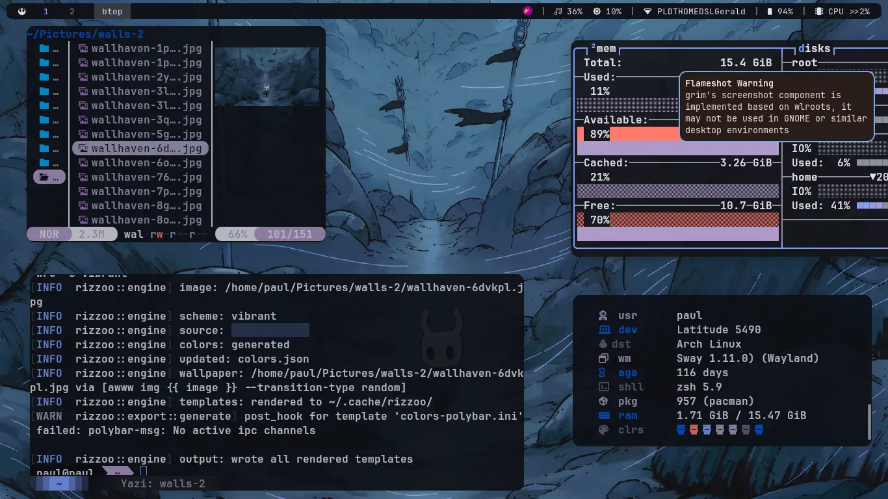

<div align="center">
  
   <br><br>
  
   <br><br> 
  <br>
  cross-platform Material 3 Expressive color generation
  <br>
  <sub>
  (pronounced: rihz-oo)
  </sub>
  <br><br>
  
  <a href="https://crates.io/crates/rizzoo">
    
  </a>
  
  <br><br>
  <a href="#showcase">Showcase</a>
  |
  <a href="#installation">Installation</a>
  |
  <a href="https://github.com/plgbrlism/rizzoo/wiki">Wiki</a>
  |
  <a href="#acknowledgements">Acknowledgements</a>
</div>

<h2 class="features">
     <sub>
          
     </sub>
     Features
</h2>

- **Material 3 Expressive** 
	- M3 palette from any image, URL, or hex color
- **Source Color Picking**
	- choose the preferred source color from the most optimal ones.
- **Scheme Blending** 
	- mix two Material 3 styles
- **Templating & Configuration** 
	- define templates, output paths, post hooks, and general configurations
- **Winnow-based Template Engine** 
	- minimal and simple color manipulation
- **Intuitive Color Filters** 
	- `hex`, `rgb`, `hsl`, `lighten`, `darken`, `blend`, `harmonize`, `ensure_contrast`, and more...
- **Cross-platform Wallpaper Wrappers** 
	- Windows, Macos, X11(Linux), Wayland(Linux)
- **Caching** 
	- identical images never regenerate
- **Live Reload** 
	- watch for changes and renders automatically

<h2 id="showcase">
     <sub>
          
     </sub>
     Showcase
</h2>




<h2>
     <sub>
          
     </sub>
     Usage
</h2>

```sh
# from an image
rizzoo -i ~/Pictures/wall.jpg -r -o -p

# from a hex color
rizzoo -c "#7c3aed" -r -o -p

# from a URL
rizzoo -u "https://example.com/wall.jpg" -r -o

# first run? generate a config file
rizzoo --init
```

<details><summary>View Full Reference</summary>

```
Usage: rizzoo [OPTIONS]

Options:
  -i, --image <PATH>         image path as color source
  -u, --image-url <URL>      url link of an image as the color source
  -c, --color <HEX>          a color of your choice in hex format
  -R, --reload-scheme        reload the last generated color scheme
  -p, --preview              print palette table
  -r, --render               fill template files with colors
  -o, --output               write all processed templates to output
      --output-to <APP>      write specific processed template to output
  -w, --wallpaper            set as desktop wallpaper
  -q, --silent               no process printed on screen
  -n, --dry-run              read and write flags won't be applied
  -S, --style <STYLE>        [default: tonal-spot] [possible values: tonal-spot, neutral, vibrant, expressive, rainbow, fruit-salad, monochrome, fidelity, content]
      --light                generate light variant colors
  -W, --watch                reload when files change
  -t, --contrast <LEVEL>     increase color contrast [default: standard] [possible values: standard, medium, high]
  -P, --pick <N>             explicitly choose a source color
  -e, --prefer <MODE>        auto-pick source color based on... [possible values: darkness, lightness, saturation]
      --open-picker          open the interactive color picker
  -b, --blend-style <STYLE>  blend with another style (requires --blend-ratio) [possible values: tonal-spot, neutral, vibrant, expressive, rainbow, fruit-salad, monochrome, fidelity, content]
      --blend-ratio <RATIO>  blend ratio 0.1-0.9 when using --blend-style [default: 0.5]
      --init                 generate configuration file
      --init-overwrite       overwrite configuration file with defaults
  -h, --help                 Print help
  -V, --version              Print version
```

</details>

<h2 id = "configuration">
     <sub>
          
     </sub>
     Configuration
</h2>

`rizzoo` reads `~/.config/rizzoo/config.toml`. `rizzoo --init` generates the default configuration file.

```toml
style = "tonal-spot"
light = false
contrast = "standard"

[wallpaper]
set = false
command = "swaybg -i {{ image }} -m fill"

[custom_colors]
accent = { color = "#e06c75", blend = true }

[alacritty]
template = "colors-alacritty.toml"
output   = "~/.config/alacritty/colors.toml"
post_hook = "pkill -SIGUSR1 alacritty"
```

`post_hook` runs after the template is written. Add `enabled = false` to skip an entry.

<h2>
  	<sub>
  		 
  	</sub>
  	Templates
</h2>

Templates live in `~/.config/rizzoo/templates/`. `-r` renders them to cache, `-o` writes them to each entry's output path.

### Variables

Every Material role is a hex string: `{{ primary }}`, `{{ on_primary }}`, `{{ surface }}`, `{{ background }}`, `{{ outline }}`, `{{ error }}`… plus `{{ shadow }}`, `{{ scrim }}`, `{{ custom_<name> }}`, and `{{ wallpaper }}`.

### Filters

<details>
<summary>View Table</summary>

| Filter | Syntax | Output |
|--------|---------|--------|
| `hex_raw` | `{{ primary:hex_raw }}` | `a6ebc3` |
| `rgb` | `{{ primary:rgb }}` | `rgb(166, 235, 195)` |
| `rgba` | `{{ primary:rgba(0.5) }}` | `rgba(166, 235, 195, 0.5)` |
| `hsl` | `{{ primary:hsl }}` | `hsl(150, 59%, 79%)` |
| `hsla` | `{{ primary:hsla(0.5) }}` | `hsla(150, 59%, 79%, 0.5)` |
| `hue` / `saturation` / `lightness` | `{{ primary:hue }}` | `150` |
| `r` / `g` / `b` | `{{ primary:r }}` | `166` |
| `lighten` / `darken` | `{{ primary:lighten(0.1) }}` | adjusted color |
| `saturate` / `desaturate` | `{{ primary:saturate(0.2) }}` | adjusted color |
| `invert` / `grayscale` | `{{ primary:invert }}` | transformed color |
| `blend` | `{{ primary:blend(%secondary, 0.5) }}` | CAM16-UCS blend |
| `harmonize` | `{{ primary:harmonize(%tertiary) }}` | hue-shifted toward target |
| `ensure_contrast` | `{{ on_surface:ensure_contrast(%surface, 4.5) }}` | WCAG-safe color |

</details>

All chainable via colon `:` ➔ `{{ primary:darken(0.1):hex_raw }}`. Bare `%var` args resolve to other template variables.

### Example

```css
/* material.css */
:root {
  --md-sys-color-primary: {{ primary }};
  --md-sys-color-on-primary: {{ on_primary }};
  --md-sys-color-surface: {{ surface }};
}
```

Check [`example/`](example/) for a sandboxed testing script.

<h2 id = "installation">
     <sub>
          
     </sub>
     Installation
</h2>

<h4>
     <sub>
          
     </sub>
     &nbsp;Cargo
     <a href="https://crates.io/crates/rizzoo"></a>
</h4>

<details><summary>Click to expand</summary>

```sh
cargo install rizzoo
```

</p>
</details>

<h4>
	<sub>
		 
	</sub>
	&nbsp;Source
</h4>

<details><summary>Click to expand</summary>

```sh
git clone https://github.com/plgbrlism/rizzoo && cd rizzoo

cargo build --release
```

</p>
</details>

<h2 id = "acknowledgements">
     <sub>
          
     </sub>
     Acknowledgements
</h2>

- [matugen](https://github.com/InioX/matugen) — material theming inspiration
- [pywal](https://github.com/dylanaraps/pywal) — popularized wallpaper-based color theming
- [mcu-material-color](https://crates.io/crates/mcu-material-color) — rust port of google material color utilities
- [wallust](https://codeberg.org/explosion-mental/wallust.git)
- [hellwal](https://github.com/danihek/hellwal) 
- [cwal](https://github.com/nitinbhat972/cwal)

<h2>
  	<sub>
  		 
  	</sub>
    License
</h2>

[MIT](LICENSE.md)
